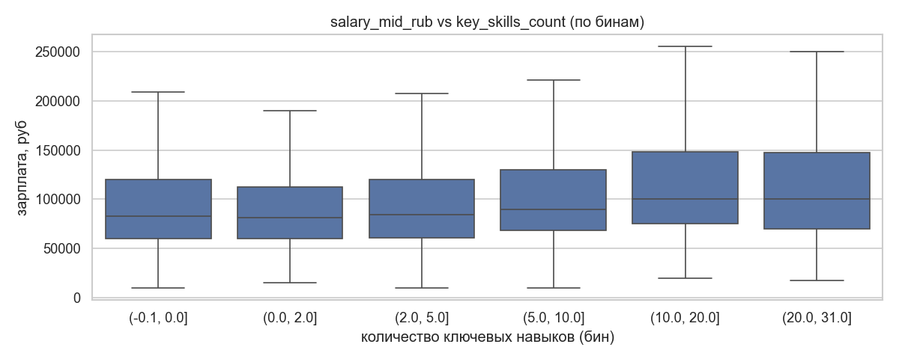
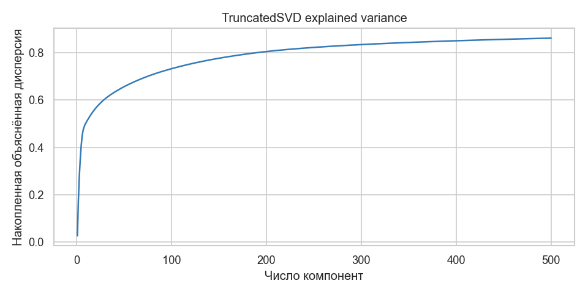
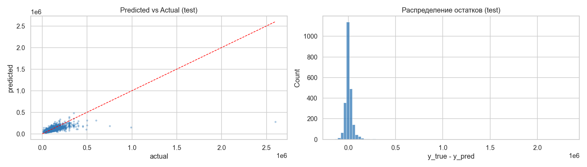

# Отчёт по проекту

**Студент:** Левитская Диана Юрьевна
**Группа:** БИВ 238

---

## 1. Введение и постановка задачи

- **Цель проекта:** Предсказать уровень заработной платы по описанию вакансии с hh.ru. Практическая ценность — помочь соискателям оценить справедливость предложенной зарплаты и помочь работодателям ориентироваться в рынке при публикации вакансий.
- **Формулировка задачи:** регрессия
- **Обоснование метрики качества:** MAE Выбраны и вспомогательные метрики для лучшего понимания ситуации: RMSE и R2 MAE ... главное число для бизнеса и для финального вывода о качестве RMSE ... диагностика поведения на высоких зарплатах + стандарт R2 ... удобный безразмерный показатель для сравнения моделей

---

## 2. Поиск и описание данных

- **Источник данных:** Данные собраны с платформы hh.ru двумя способами: через официальный API hh.ru (парсер реализован в src/parser.py) и через готовую CSV-выгрузку, обработанную скриптом src/preprocessing.py. Поскольку одобрение заявки на приложение со стороны API hh.ru заняло длительное время, основная часть данных получена из CSV-выгрузки. Итоговый датасет сохранён в формате Parquet: data/processed/vacancies.parquet.

- **Описание датасета:**
  - 15 887 строк × 22 столбца до очистки;
  - после удаления выбросов и лишних колонок — 15 355 строк × 17 столбцов.
- **Описание признаков:**

|Признак|Тип|Смысл|
|-------|---|-----|
|id|object|Уникальный идентификатор вакансии|
|name|object (text)|Название вакансии|
|area_id / area_name|object (cat)|Код и название региона|
|employer_name / employer_id|object (cat)|Название и идентификатор работодателя|
|employer_trusted|bool|Признак «проверенный работодатель»|
|experience / experience_name|object (cat)|Код и название требуемого опыта|
|employment / schedule|object|Тип занятости и режим работы|
|has_test|bool|Наличие тестового задания|
|response_letter_required|bool|Требуется ли сопроводительное письмо|
|key_skills|object (list)|Список ключевых навыков|
|key_skills_count|int|Количество ключевых навыков|
|professional_role_ids / professional_role_name|sobject (list)|Профессиональные роли|
|description|object (text)|Полное описание вакансии|
|published_at|datetime|Дата публикации|
|salary_from_rub|float|Зарплата в другой валюте|
|salary_to_rub|float|Зарплата в рублях|
|salary_mid_rub|float|Целевая переменная — средняя зарплата в рублях|
---

## 3. Обработка и подготовка данных

- **Полная очистка:**
  - Пропуски: Обнаружены через df.isna().sum(). Колонки employment и schedule оказались полностью пустыми (100% NaN) и удалены как константные. employer_trusted — 0.23% пропусков. salary_to_rub — 48% пропусков (вакансии с «вилкой» только снизу), salary_from_rub — 8.9%, salary_mid_rub — 2.19% (строки без таргета удалены). Числовые признаки заполняются медианой, категориальные — константой "missing".
  - Дубликаты: Проверены, дублей не обнаружено.
  - Выбросы: Зарплаты ниже 10 000 руб. и выше 5 000 000 руб. отсечены на этапе предобработки. В EDA применено дополнительное правило 3-сигма: удалены 66 вакансий с зарплатой выше 300 000 руб., что улучшило устойчивость обучения бустинга.
  - Типы данных: Приведены корректные типы: datetime — для published_at, int — для key_skills_count, object — для текстовых и категориальных полей.
- **Работа с фичами:**
  - Исходное количество признаков: 22 (после удаления константных, leak-колонок и идентификаторов — 15 рабочих признаков).
  - Data leakage: Исключены salary_from_rub и salary_to_rub — они напрямую участвуют в расчёте таргета.
  - Feature engineering: Добавлена фича SpectralClusterFeature — метка семантического кластера вакансии, полученная через pipeline TF-IDF -> TruncatedSVD -> SpectralClustering на названии (name). Fit выполняется только на train, val/test разметка — через ближайший центроид кластера в SVD-пространстве (inductive extension, без утечки).
  - Трансформация таргета: Обучение ведётся на log1p(salary_mid_rub) через TransformedTargetRegressor, метрики считаются в рублях через expm1. Это обосновано сильной правосторонней скошенностью распределения зарплат.
- **Визуализации:** графики, отражающие распределения, зависимости между признаками и целевой переменной
  Зависимость зарплаты от количества ключевых навыков. Boxplot показывает слабую, но устойчивую положительную зависимость: вакансии с бо́льшим числом указанных навыков в среднем предлагают более высокую зарплату. Spearman-корреляция с таргетом ≈ 0.11.
  

  Объяснённая дисперсия TruncatedSVD. График накопленной объяснённой дисперсии при уменьшении размерности TF-IDF + OHE матрицы. Показывает, сколько информации сохраняется при выборе числа SVD-компонент. Использовался для эксперимента «Ridge + TruncatedSVD(200)» и при построении SpectralClusterFeature.
  

  Анализ остатков финальной модели. Слева — распределение остатков: большинство ошибок сконцентрировано в диапазоне 30 тыс. руб., хвост вправо соответствует недооценке высоких зарплат. Справа — предсказанные значения против фактических: точки хорошо ложатся вдоль диагонали в диапазоне 40–200 тыс. руб., заметна систематическая недооценка в сегменте >150 тыс. руб.
  

  Также в ходе EDA построены: гистограммы и boxplot `salary_mid_rub` до и после удаления выбросов, гистограмма `log1p(salary_mid_rub)`, boxplot зарплат по уровню опыта (`experience_name`), топ-15 работодателей и регионов по медианной зарплате.
  
- **Сплит данных:**
  - Соотношение: 70% / 15% / 15% (train / val / test)
  - Стратификация по бинам log1p(salary_mid_rub), чтобы хвосты распределения попали во все три выборки
  - Data leakage исключён: fit всех трансформеров (scaler, encoder, TF-IDF, SVD, SpectralClustering) выполняется только на train. Val и test только трансформируются

---

## 4. Baseline-модель

- **Модели:**
  - `DummyRegressor(strategy="median")` — тривиальный baseline, всегда предсказывает медиану.
  - `LinearRegression` — простая линейная модель без feature engineering, с базовым `ColumnTransformer` (медиан-импутация + StandardScaler для числовых, OHE для категориальных, TF-IDF для текстовых и списочных).
- **Результаты на test:**

| Модель | MAE, руб | RMSE, руб | R2 | MAPE, % |
|---|---|---|---|---|
| DummyRegressor (median) | 43 035 | 85 793 | −0.05 | 43.6 |
| LinearRegression | 125 740 | 315 852 | −13.18 | 134.2 |
 
- **Вывод:** LinearRegression в базовой конфигурации переобучается из-за высокой размерности разреженных признаков (TF-IDF + OHE). DummyRegressor — точка отсчёта. Регуляризованный Ridge (см. эксперименты) решает проблему.

---

## 5. Эксперименты
Все модели обёрнуты в `TransformedTargetRegressor` (обучение на `log1p(y)`, метрики — в рублях через `expm1`). Fit трансформеров — только на train. Метрики на val. Каждый эксперимент оформлен по схеме: **Гипотеза → Как проверялось → Результат**.
 
### Эксперимент 1 — Ridge (sanity-check baseline)
 
**Гипотеза.** Регуляризованная линейная модель на тех же фичах должна дать результат, близкий к baseline из ноутбука 02. Если отклонение большое — значит сплит или препроцессинг поехали.
 
**Как проверялось.** Ridge с α=1.0, тот же `ColumnTransformer`, обучение на log1p(y).
 
**Результат.** val MAE = 22 190 руб. — модель работает и служит точкой отсчёта для более сложных подходов.
 
### Эксперимент 2 — RandomForest + RandomizedSearchCV
 
**Гипотеза.** RandomForest умеет ловить нелинейности и взаимодействия фичей, должен опередить Ridge.
 
**Как проверялось.** `RandomizedSearchCV` по пространству `n_estimators / max_depth / min_samples_leaf / max_features`, 6 итераций × 3 фолда. RandomizedSearch вместо Grid — комбинаций много, время дорого. Поиск только на train.
 
**Результат.** val MAE = 24 382 руб. — хуже Ridge. RF сильно переобучается (train MAE = 9 456 против val MAE = 24 382) на разреженных TF-IDF фичах.
 
### Эксперимент 3 — LinearSVR + GridSearchCV
 
**Гипотеза.** На разреженных фичах (OHE + TF-IDF) линейный `LinearSVR` масштабируется лучше ядерного SVR и иногда выигрывает у Ridge за счёт epsilon-insensitive loss.
 
**Как проверялось.** `GridSearchCV` по сетке `C ∈ {0.1, 1.0, 5.0} × epsilon ∈ {0.0, 0.05, 0.1}`, 3 фолда (9 комбинаций). `dual="auto"`, `max_iter=5000`.
 
**Результат.** val MAE = 22 196 руб. при лучших params `C=0.1, epsilon=0.05` — вплотную к Ridge, но немного хуже и в 24 раза медленнее.
 
### Эксперимент 4 — CatBoost (нативный API)
 
**Гипотеза.** CatBoost со встроенной поддержкой категориальных и текстовых фичей должен обойти Ridge: он не требует OHE и TF-IDF — работает с сырыми строками напрямую.
 
**Как проверялось.** CatBoost обучается в нативном API (без sklearn-пайплайна), принимая `cat_features` и `text_features` напрямую. Использовался `log1p(y)` как таргет, early stopping по val-пулу. Для устойчивости на хвосте отбрасывались вакансии выше 99.5-го перцентиля (≥300 тыс. руб., 66 строк). Перебиралось 4 конфигурации глубины и learning rate.
 
**Результат.** val MAE = 25 708 руб. — хуже Ridge несмотря на нативную обработку категорий. CatBoost плохо работает с текстами через `text_features` на коротких названиях вакансий.
 
### Эксперимент 5 — уменьшение размерности (TruncatedSVD + Ridge)
 
**Гипотеза.** TF-IDF + OHE порождают тысячи фичей. SVD до 500 компонент должен убрать шум и сохранить основной сигнал; Ridge на сжатом представлении может не уступить «полному».
 
**Как проверялось.** `TruncatedSVD(n_components=500)` применяется после `ColumnTransformer`, затем Ridge. `TruncatedSVD` вместо `PCA` — матрица разреженная, плотный PCA не пролезет в память. График объяснённой дисперсии (см. `images/svd_explained_variance.png`) использовался при выборе числа компонент.
 
**Результат.** val MAE = 24 046 руб. — хуже полного Ridge. Сжатие теряет часть полезного сигнала.
 
### Эксперимент 6 — LightGBM (default)
 
**Гипотеза.** LightGBM использует leaf-wise стратегию построения деревьев и хорошо масштабируется на разреженных данных — быстрее CatBoost и, возможно, точнее Ridge.
 
**Как проверялось.** LightGBM в sklearn-пайплайне с дефолтными параметрами (n_estimators=800, learning_rate=0.03, num_leaves=63), тот же `ColumnTransformer`, log1p-таргет.
 
**Результат.** val MAE = 22 021 руб. — лучше Ridge и LinearSVR без какого-либо подбора параметров. Хороший кандидат на финальную модель.
 
### Эксперимент 7 — LightGBM + Optuna
 
**Гипотеза.** Подбор гиперпараметров через байесовскую оптимизацию улучшит LightGBM.
 
**Как проверялось.** `Optuna` с TPE-сэмплером, 20 trials. Пространство поиска: `n_estimators ∈ [1000, 3000]`, `learning_rate ∈ [0.005, 0.1]`, `num_leaves ∈ [31, 127]`, `min_child_samples ∈ [5, 50]`, `subsample`, `colsample_bytree`, `reg_alpha`, `reg_lambda`. Целевая функция — CV MAE на train (3 фолда). Поиск только на train, val не светится.
 
**Результат.** val MAE = 21 855 руб. — **лучший результат среди всех экспериментов**. Лучшие параметры: n_estimators=2899, lr=0.0138, num_leaves=97, min_child_samples=8, subsample=0.776, colsample_bytree=0.840, reg_alpha=0.071, reg_lambda=0.780.
 
### Эксперимент 8 — CatBoost + SpectralCluster feature
 
**Гипотеза.** Метка семантического кластера вакансии (получена через TF-IDF → TruncatedSVD → SpectralClustering по названию) даст модели полезный сигнал «к какой группе относится вакансия» поверх стандартных фичей.
 
**Как проверялось.** Кастомный трансформер `SpectralClusterFeature`: fit (TF-IDF, SVD, SpectralClustering, центроиды) — только на train; val/test размечаются через ближайший центроид в SVD-пространстве (inductive extension, без утечки). Параметры: n_clusters=30, svd_components=60, knn_neighbors=15. Базовая модель — CatBoost.
 
**Результат.** val MAE = 22 756 руб. — хуже LightGBM (Optuna). Спектральная фича добавляет осмысленные кластеры (топ-токены проверены), но не улучшает качество относительно дополнительных затрат.
 
### Эксперимент 9 — LightGBM + SpectralCluster feature
 
**Гипотеза.** SpectralCluster-фича может лучше сработать с LightGBM, чем с CatBoost, за счёт leaf-wise бустинга на разреженных данных.
 
**Как проверялось.** Те же параметры SpectralClusterFeature (n_clusters=30, svd_components=60), LightGBM с num_leaves=63, lr=0.03, n_estimators=3000.
 
**Результат.** val MAE = 22 206 руб. — лучше CatBoost+Spectral, но хуже LightGBM (Optuna) без дополнительной фичи. Спектральная кластеризация не даёт прироста.

### Сводная таблица экспериментов на val
 
| Модель | Ключевые параметры | val MAE, руб | val RMSE, руб | val R² | Комментарий |
|---|---|---|---|---|---|
| **LightGBM (Optuna)** | n_estimators=2899, lr=0.0138, num_leaves=97; 20 trials Optuna | **21 855** | 33 452 | 0.582 | **Лучший val MAE → финальная модель** |
| LightGBM (default) | n_estimators=800, lr=0.03, num_leaves=63 | 22 021 | 33 068 | 0.592 | Хорош без настройки |
| Ridge | α=1.0 | 22 190 | 32 496 | 0.606 | Лучший R², быстро |
| LinearSVR + GridSearchCV | C=0.1, epsilon=0.05; 9 комбинаций × 3 folds | 22 196 | 32 943 | 0.595 | Вплотную к Ridge, в 24× медленнее |
| LightGBM + SpectralCluster | n_clusters=30, svd_components=60, num_leaves=63, lr=0.03 | 22 206 | 33 801 | 0.573 | Spectral-фича не помогает |
| CatBoost + SpectralCluster | n_clusters=30, svd_components=60, depth=6, lr=0.03 | 22 756 | 34 417 | 0.558 | CatBoost хуже LightGBM с той же фичей |
| Ridge + TruncatedSVD(500) | 500 SVD-компонент | 24 046 | 35 044 | 0.541 | Сжатие теряет сигнал |
| RandomForest + RandomizedSearchCV | max_features=0.3, max_depth=None; 6 iter × 3 folds | 24 382 | 36 324 | 0.507 | Переобучается на TF-IDF |
| CatBoost (нативный API) | depth=6, lr=0.03, l2=10, early_stopping=100 | 25 708 | 47 143 | 0.491 | Нативный API не помог |
 
**Перебор гиперпараметров:**
- RandomForest — `RandomizedSearchCV` (6 итераций × 3 фолда, scoring=neg_MAE).
- LinearSVR — `GridSearchCV` (9 комбинаций × 3 фолда).
- LightGBM — `Optuna` (20 trials, TPE-сэмплер, CV MAE на log-шкале).
**Уменьшение размерности:**
Эксперимент «Ridge + TruncatedSVD(500)» показал, что сжатие признакового пространства ухудшает качество (MAE растёт с 22 190 до 24 046 руб.). Используется `TruncatedSVD` вместо `PCA`, поскольку матрица после OHE + TF-IDF разреженная.
---

## 6. Финальная модель и интерпретируемость
Финальная модель — **LightGBM (Optuna)** с параметрами, найденными за 20 trials Optuna. Она показала наименьший `val MAE = 21 855 руб.` среди всех экспериментов. LightGBM хорошо работает на смешанных разреженных данных (OHE + TF-IDF), обучается быстрее CatBoost и не теряет преимуществ при прохождении через `ColumnTransformer`. LightGBM (Optuna) выигрывает у Ridge по MAE на ~340 руб. и заметно лучше ведёт себя на верхнем хвосте распределения зарплат, хотя уступает по R² (0.582 против 0.606 у Ridge). Добавление SpectralCluster-фичи не дало прироста при существенных дополнительных затратах, поэтому финальный пайплайн использует стандартный `ColumnTransformer` без спектральной кластеризации.
 
**Результаты на test:**
 
| Метрика | Значение |
|---|---|
| MAE | **21 785 руб.** |
| RMSE | 32 497 руб. |
| R² | 0.582 |

---

## 7. Деплой

### Общая архитектура

Для деплоя модель упакована в два независимых сервиса, запускаемых через Docker Compose: inference API на FastAPI и пользовательский интерфейс на Streamlit. Такое разделение позволяет обновлять интерфейс и модель независимо друг от друга.

### Сохранение модели
Финальный sklearn-пайплайн (препроцессинг + LightGBM, обёрнутый в TransformedTargetRegressor) сохранён с помощью joblib.dump в файл models/final_model.joblib. Пайплайн включает кастомные трансформеры (ListToStringTransformer, SpectralClusterFeature и др.), определённые в ноутбуке, — это потребовало отдельной работы при загрузке модели в сервере.

### Inference API (FastAPI)
Сервер реализован на FastAPI (api/main.py). Пайплайн загружается один раз при старте (@app.on_event("startup")) и остаётся в памяти. Доступны два эндпоинта:

- GET/health - Проверка готовности сервиса (используется docker-compose healthcheck)

- POST/predict - Принимает JSON со списком вакансий, возвращает предсказанные зарплаты в рублях

При разработке сервера возникла нетривиальная проблема: кастомные классы трансформеров были сохранены pickle-ом с путём __main__.* (модуль Jupyter-ноутбука), а uvicorn загружает приложение под именем __mp_main__. Из-за этого joblib.load падал с AttributeError. Проблема решена регистрацией всех кастомных классов в sys.modules["__main__"] и sys.modules["__mp_main__"] до вызова joblib.load

### Пользовательский интерфейс (Streamlit)
Streamlit-интерфейс выходит за рамки материала курса, поэтому его код был сгенерирован с помощью ИИ-ассистента и доработан под нужды проекта. Интерфейс поддерживает два режима работы:

- Ручной ввод — пользователь заполняет форму с параметрами вакансии (название, работодатель, город, опыт, навыки, описание) и получает предсказание.

- Поиск на hh.ru — пользователь вставляет ссылку на вакансию или вводит поисковый запрос, интерфейс загружает карточку через официальный API hh.ru, показывает её содержимое и по нажатию кнопки запускает предсказание.

Результат отображается как предсказанная зарплата на руки в рублях.
### Docker Compose

Оба сервиса описаны в docker-compose.yml. Streamlit-контейнер стартует только после того, как API пройдёт healthcheck, что гарантирует отсутствие запросов к ещё не готовому сервису.

Ссылка на видео: https://disk.yandex.ru/d/sN59VO-5z5OMAw
---

## 8. Заключение и выводы

- **Итоги:** достигнутые результаты, сравнение с baseline
- **Ограничения:** что не удалось, почему
- **Возможные улучшения:** идеи для дальнейшей работы
